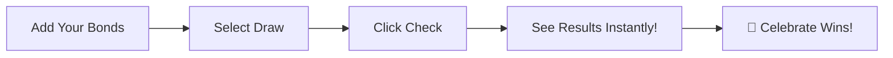

# 🎯 Prize Bond Checker - Your Lucky Number Companion

<div align="center">
  
  
  
  
</div>

<div align="center">
  <h3>🏆 Never Miss a Prize Again!</h3>
  <p><strong>Check your Bangladesh Prize Bonds instantly at</strong></p>
  <h2>🌐 <a href="https://prizebond.shounakraj.com">prizebond.shounakraj.com</a></h2>
</div>

---

## 💫 What Makes Us Special?

Imagine never having to manually check hundreds of prize bond numbers against draw results again. That's exactly what we built! A lightning-fast, user-friendly platform that does all the heavy lifting for you.

### 🚀 Key Features That You'll Love

| Feature | Description |
|---------|-------------|
| **⚡ Bulk Bond Entry** | Add multiple bonds at once - no more typing one by one! |
| **🔍 Smart Matching** | Instantly matches your bonds against all winning numbers |
| **📊 Winning History** | Track all your wins in one place with prize amounts |
| **⬇️ Export to Excel/CSV** | Download your entire bond list as a CSV file for offline use or sharing |
| **🌍 Bilingual Support** | Seamlessly switch between English and Bengali |
| **🔐 Secure Authentication** | Login with email or Google - your data is always safe |
| **📱 Mobile Friendly** | Check results on the go from any device |

## 🎨 Built With Modern Tech

<table>
<tr>
<td align="center" width="96">
  
  <br>Next.js 15
</td>
<td align="center" width="96">
  
  <br>React 19
</td>
<td align="center" width="96">
  
  <br>MySQL
</td>
<td align="center" width="96">
  
  <br>Tailwind v4
</td>
</tr>
</table>

## 🎯 How It Works



## 🛠️ For Developers

Want to run this locally? Here's how:

```bash
# Clone the repository
git clone https://github.com/yourusername/prizebond-checker.git

# Navigate to project
cd prizebond-checker

# Install dependencies
npm install

# Set up environment variables
cp .env.example .env.local

# Run development server
npm run dev
```

### 📋 Environment Variables

```env
# Database
DB_HOST=your_mysql_host
DB_USER=your_mysql_user
DB_PASSWORD=your_mysql_password
DB_NAME=your_database_name

# Authentication
JWT_SECRET=your_jwt_secret

# Firebase (for Google Auth)
NEXT_PUBLIC_FIREBASE_API_KEY=your_firebase_api_key
NEXT_PUBLIC_FIREBASE_AUTH_DOMAIN=your_firebase_auth_domain
NEXT_PUBLIC_FIREBASE_PROJECT_ID=your_firebase_project_id
```

## 🌟 Features in Action

### 📝 Add Bonds in Bulk
Simply enter a range like "100-200" and we'll add all 101 bonds for you!

### 🎯 Instant Results
Select a draw number and see all your winning bonds highlighted with prize amounts.

### ⬇️ Export All Bonds to Excel/CSV
Download your entire bond list (not just the current page) as a CSV file with one click from your profile page. Great for backups, sharing, or offline use!

### 🌐 Language Support
Toggle between English and Bengali with a single click - আপনার সুবিধার জন্য!

## 📦 Dependencies

- **UI:** [shadcn/ui](https://ui.shadcn.com/) for modern, accessible React components
- **CSV Export:** [papaparse](https://www.papaparse.com/) for fast client-side CSV generation

## 📊 API Endpoints

| Endpoint | Method | Description |
|----------|--------|-------------|
| `/api/auth/login` | POST | User login |
| `/api/auth/signup` | POST | User registration |
| `/api/user/bonds` | GET/POST | Manage bonds |
| `/api/user/bonds` | DELETE | Delete a bond |
| `/api/user/prize-bond` | PUT | Claim a bond |
| `/api/user/prize-bond/history` | GET | Get winning history |
| `/api/draw/check-results` | POST | Check results |
| `/api/draw/range` | GET | Get draw ranges |

## 🎉 Success Stories

> "I found out I won 1 lakh taka that I would have never known about!" - Happy User

> "Managing 500+ bonds is now a breeze!" - Power User

## 📱 Screenshots

<div align="center">
  <table>
    <tr>
      <td align="center">
        <strong>🏠 Homepage</strong><br>
        Clean and intuitive interface
      </td>
      <td align="center">
        <strong>📊 Results Page</strong><br>
        See all your wins at a glance
      </td>
      <td align="center">
        <strong>👤 Profile</strong><br>
        Manage bonds and view history
      </td>
    </tr>
  </table>
</div>

## 🚀 Performance

- ⚡ **Lightning Fast**: Results in under 2 seconds
- 🔒 **Secure**: JWT authentication + bcrypt encryption
- 📱 **Responsive**: Works on all devices
- 🌍 **Scalable**: Built to handle millions of bonds

## 📞 Connect

<div align="center">
  
🌐 **Live App**: [prizebond.shounakraj.com](https://prizebond.shounakraj.com)

Made with ❤️ for the people of Bangladesh 🇧🇩

</div>

---

<div align="center">
  <sub>Never let luck slip away - Check your bonds today!</sub>
</div>